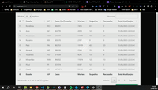

# COVID - 19
  Sistema consumindo api sobre o covid-19
<!--
## Guards - Table - Model

## Sessões

## Cokkies

## Z-index 

-->
## :hammer: Funcionalidades

- [x] Consulta de dados relacionados ao covid-19
- [x] Compartilhamento de informações pelo whatsapp web

## :computer: Tecnologias Utilizadas
~~~FrontEnd
* HTML 5
* CSS 3
* BOOTSTRAP ^5.2.3
* BLADE
* JQUERY
* NODE 16.14.2
* NPM 8.5.0
~~~

~~~ BackEnd
* PHP 7.4.9
* LARAVEL 8
~~~

<!-- ~~~Banco
* Ban
~~~ -->
## Inicialização
1. Certifique-se de ter instalado na sua máquina o php correto
2. Faça o `git clone url_projeto -b main`
3. Duplique o arquivo `.env.example` e retire o `.example`
4. Configure as variaveis de conexao com o banco de dados
5. Execute `composer install`
6. Caso queira fazer mudanças com o sass execute `npm install` em seguida `npm run watch`
7. Execute `php artisan key:generate`
8. Execute `php artisan serve`

## Implementações Futuras
 :construction:  Sem previsão!  :construction:

## Colaboradores
 --- **N/A** ---

## :eyes: Status Projeto
:heavy_check_mark:  Não adicionei versão

## :movie_camera: Gif de exemplo chat privado

### Observação
 <!-- Para enviar mensagens use `SHIFT + ENTER` 
 Caso ocorra erro na instalação, instale o node(LTS) 16.14.2 e execute `npm install` && `npm run dev` -->
