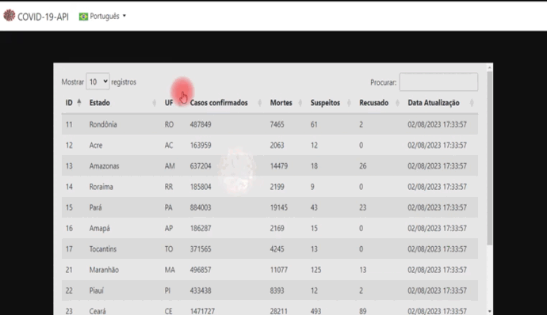

<!--
Readme template -> https://github.com/othneildrew/Best-README-Template
## Guards - Table - Model

## Sessões

## Cokkies

## Z-index 

-->

<!-- PROJETO LOGO -->
 

  

  <h3 align="center">COVID-19</h3>

  

    Sistema consumindo API sobre o covid-19 no Brasil
    <!--  
    <a href="URL_DOCS"><strong>Explore the docs »</strong></a>
     
     
    <a href="URL_SERVIDOR">View Demo</a>
    ·
    <a href="https://github.com/othneildrew/Best-README-Template/issues">Report Bug</a>
    ·
    <a href="https://github.com/othneildrew/Best-README-Template/issues">Request Feature</a> -->
  

  [![portfolio][portfolio-shield]][portfolio-url]
  [![linkedin][linkedin-shield]][linkedin-url]

<!-- MENU -->

  
MENU

  <ol>
    <li>
      <a href="#sobre">Sobre</a>
    </li>
    <li><a href="#funcionalidades">Funcionalidades</a></li>
    <li><a href="#tecnologias-utilizadas">Tecnologias Utilizadas</a></li>
    <li><a href="#Instalação">Instalação</a></li>
    <li><a href="#modo-de-uso">Modo de uso</a></li>
    <li></li>
    <li><a href="#versão-atual">Versão atual</a></li>
    <li><a href="#licença">Licença</a></li>
    <li><a href="#contato">Contato</a></li>
    <!-- <li><a href="#agradecimentos">Agradecimentos</a></li> -->
    <li><a href="#observação">Observação</a></li>
  </ol>

<!-- ABOUT THE PROJECT -->
## Sobre

--- **N/A** ---

(<a href="#readme-top">Voltar ao topo</a>)

<!-- FUNCIONALIDADES -->
## Funcionalidades

- [x] Consulta de dados relacionados ao Covid-19 no Brasil
- [x] Compartilhamento de informações pelo whatsapp web
- [x] Multi linguagens suportadas
    - [x] English
    - [x] Português-BR
    - [ ] Português

## Tecnologias Utilizadas
1. FRONT-END
    * HTML 5
    * CSS 3
    * BOOTSTRAP ^5.2.3
    * BLADE
    * JQUERY 3.7
    * NODE 16.14.2
    * NPM 8.5.0
2. BACK-END
    * PHP 7.4.9
    * LARAVEL 8

(<a href="#readme-top">Voltar ao topo</a>)

See the [open issues](https://github.com/othneildrew/Best-README-Template/issues) for a full list of proposed features (and known issues).

(<a href="#readme-top">Voltar ao topo</a>)

<!-- GETTING STARTED -->
## Instalação

1. Certifique-se de ter instalado na sua máquina o php e node(npm) correto, se usa docker verficar a imagem
2. Faça o 
    ~~~git
        git clone url_projeto -b main
    ~~~
3. Duplique o arquivo `.env.example` e retire o `.example`
4. Configure as variaveis de conexao com o banco de dados
5. Execute 
    ~~~php
        composer install 
    ~~~
6. Caso queira fazer mudanças com o sass execute 
    ~~~js
        npm install
    ~~~ 
    em seguida
    ~~~js
        npm run watch
    ~~~
7. Execute 
   ~~~php
        php artisan key:generate 
   ~~~
8. Execute 
    ~~~
        php artisan serve
    ~~~

(<a href="#readme-top">Voltar ao topo</a>)

<!-- USAGE EXAMPLES -->
## Modo de uso
--- **N/A** ---
<!-- Use este espaço para mostrar exemplos úteis de como um projeto pode ser usado. Capturas de tela adicionais, exemplos de código e demonstrações funcionam bem neste espaço. Você também pode criar links para mais recursos. _Para mais exemplos, consulte a [Documentação](https://example.com)_
como por exemplo gifs, links para video etc
:movie_camera: 
 -->

(<a href="#readme-top">Voltar ao topo</a>)

<!-- COLABORADORES -->
## Colaboradores
 --- **N/A** ---

(<a href="#readme-top">Voltar ao topo</a>)

## Versão atual
:heavy_check_mark:  v1.1.0

<!-- LICENÇA -->
## Licença
--- **N/A** ---
<!-- Distribuído sob a licença MIT. Veja `LICENSE.txt` para mais informações. -->

(<a href="#readme-top">Voltar ao topo</a>)

<!-- CONTACT -->
## Contato
Tiago Alves dos Santos

Formas de contato
[![Whatsapp][whatsapp-shield]][whatsapp-url]
[![Telegram][telegram-shield]][telegram-url]

(<a href="#readme-top">Voltar ao topo</a>)

<!-- AGRADECIMENTOS -->
<!-- ## Agardecimentos

Use este espaço para listar os recursos que você considera úteis e aos quais gostaria de dar crédito. Eu incluí alguns dos meus favoritos para começar!

* [Choose an Open Source License](https://choosealicense.com)
* [GitHub Emoji Cheat Sheet](https://www.webpagefx.com/tools/emoji-cheat-sheet)
* [Malven's Flexbox Cheatsheet](https://flexbox.malven.co/)
* [Malven's Grid Cheatsheet](https://grid.malven.co/)
* [Img Shields](https://shields.io)
* [GitHub Pages](https://pages.github.com)
* [Font Awesome](https://fontawesome.com)
* [React Icons](https://react-icons.github.io/react-icons/search)

(<a href="#readme-top">Voltar ao topo</a>)
 -->

### Observação
 Link da API: https://covid19-brazil-api.vercel.app/

<!-- MARKDOWN -->
[whatsapp-shield]: https://img.shields.io/badge/WhatsApp-25D366?style=for-the-badge&logo=whatsapp&logoColor=white
[whatsapp-url]: https://wa.link/h5vlzo
[telegram-shield]: https://img.shields.io/badge/Telegram-2CA5E0?style=for-the-badge&logo=telegram&logoColor=white
[telegram-url]: https://t.me/TiagoAlves2001
[linkedin-shield]: https://img.shields.io/badge/LinkedIn-0077B5?style=for-the-badge&logo=linkedin&logoColor=white
[linkedin-url]: https://www.linkedin.com/in/tiago-alves-96699a189/
[portfolio-shield]: https://img.shields.io/badge/PORTFOLIO-%20CLIQUE%20AQUI%20-%20BLACK
[portfolio-url]: https://wa.link/h5vlzo
